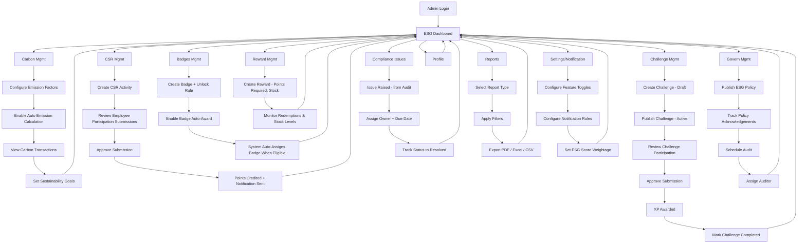
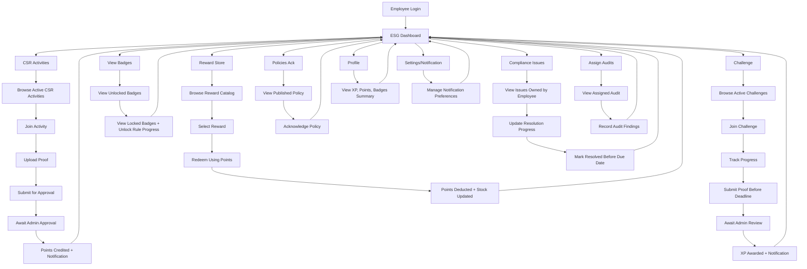
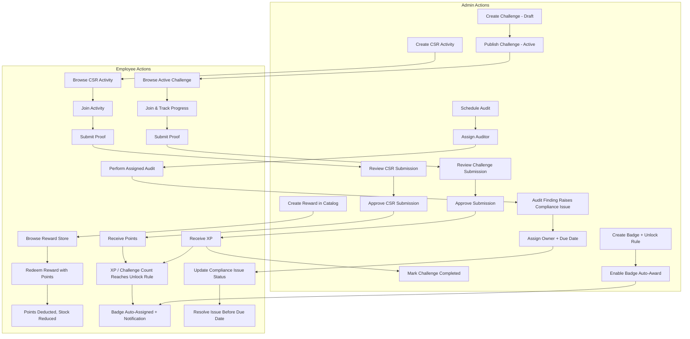

# EcoSphere - Flowcharts (Admin, Employee, Combined)

Scope: **happy-path only** (no error/rejection branches). High-level, screen/action level — matches the previous workflow doc. Render these with any Mermaid-compatible viewer (GitHub, Notion, VS Code Mermaid extension, mermaid.live).

---

## 1. Admin Flow (Login → every module)

---

## 2. Employee Flow (Login → every module)

---

## 3. Combined Flow — Admin ↔ Employee (all major loops)

Covers: **Challenge, CSR, Reward Redemption, Badge Unlock, Audit/Compliance.**

**How to read it:** each dashed pair of Admin/Employee columns is one loop. Example — Challenge loop: Admin publishes → Employee submits proof → Admin approves → Employee gets XP → Admin closes challenge. That same XP (plus CSR Points) feeds the Badge Unlock loop automatically.

---
